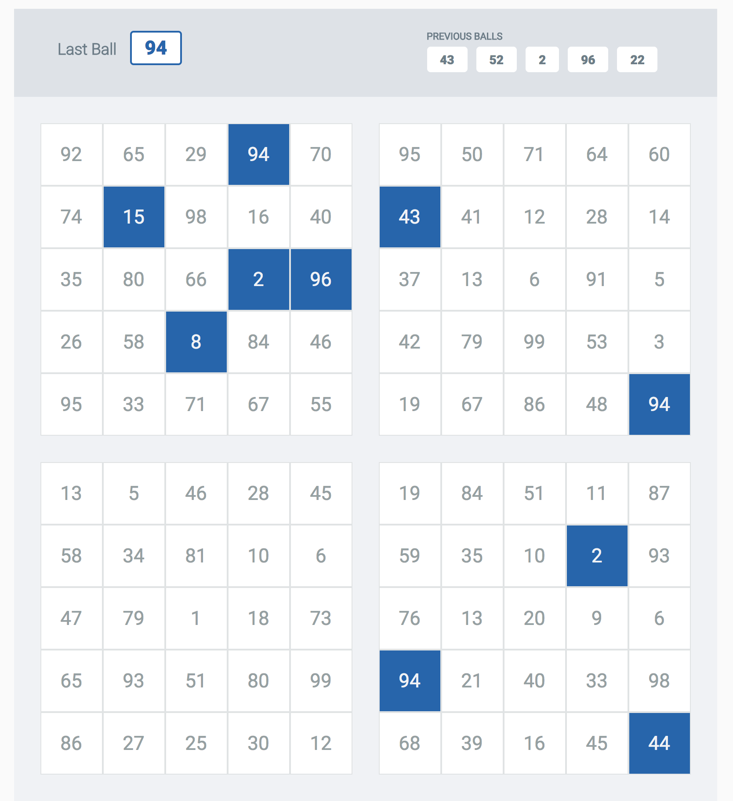

# bingo

## Requirements
* node: ^8.11.1
* npm: ^6.0.0

## Running the Game
### 1. Backend
##### Running the backend
1. From root directory
2. Run `npm install`
3. Run `npm start`

##### Running tests
Run `npm test`
**Note: Some of the tests are running against the API endpoints of the backend, therefore make sure you are running the backend before you run the tests.**

### 2. Frontend
**The frontend is running with the default webpack config that is being created when using the  "create-react-app" module**
1. Go to **./app/**
2. Run `npm install`
3. Run `npm start`

### 3. Running the GM script
The GM script, is responsible to draw balls for the bingo game.
1. Go back to the root directory
1. Run `npm run gm-script`
